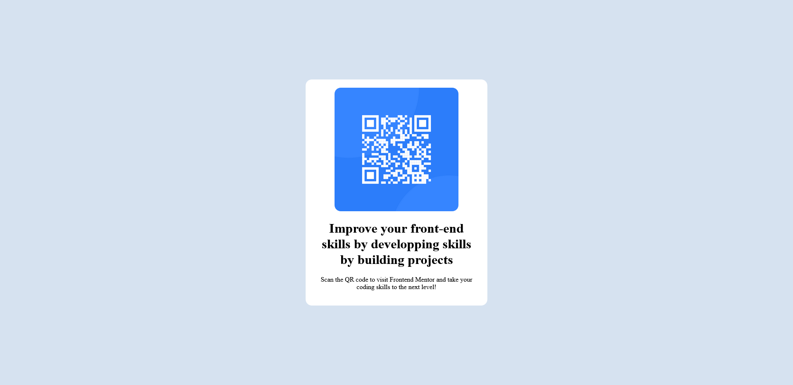

# Frontend Mentor - QR code component solution
This is a solution to the [QR code component challenge on Frontend Mentor](https://www.frontendmentor.io/challenges/qr-code-component-iux_sIO_H). Frontend Mentor challenges help you improve your coding skills by building realistic projects. 

## Table of contents
- [Overview](#overview)
  - [Screenshot](#screenshot)
- [Built with](#built-with)
- [What I learned](#what-i-learned)
- [Author](#author)

## Overview

### Screenshot



### Built with

- Semantic HTML5 markup
- CSS custom properties
- Flexbox

### What I learned

This was my first html and css project. I learned the basics of html structure and css. I was very proud of figuring out how to use Flexbox to center the image and div. I look a while to figure out how to create the white rounded background.

```css
body {
   background-color: hsl(212, 45%, 89%);
   display: flex;
   justify-content: center;
   align-items: center;
   height: 100vh;
}
```
## Author

- Frontend Mentor - [@brweinstein](https://www.frontendmentor.io/profile/brweinstein)
- Github - [@brweinstein](https://github.com/brweinstein)
